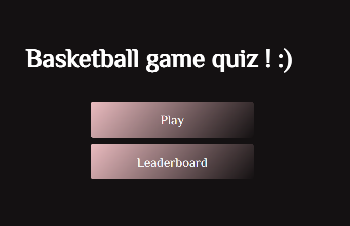
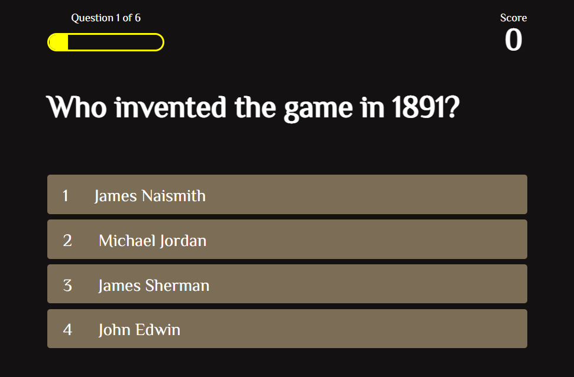
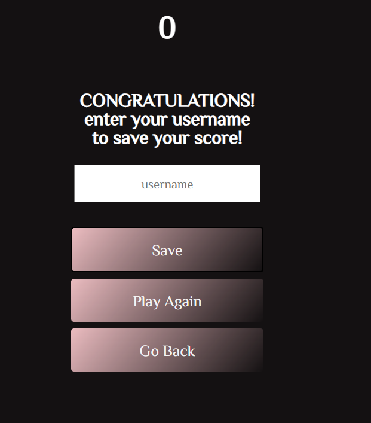
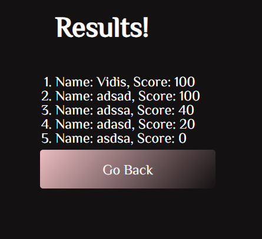
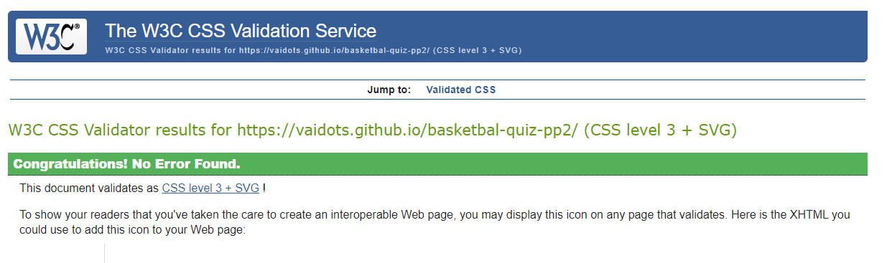
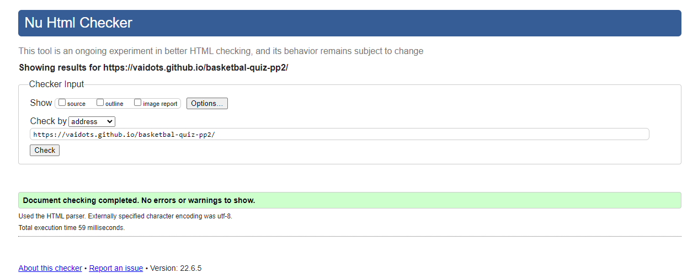
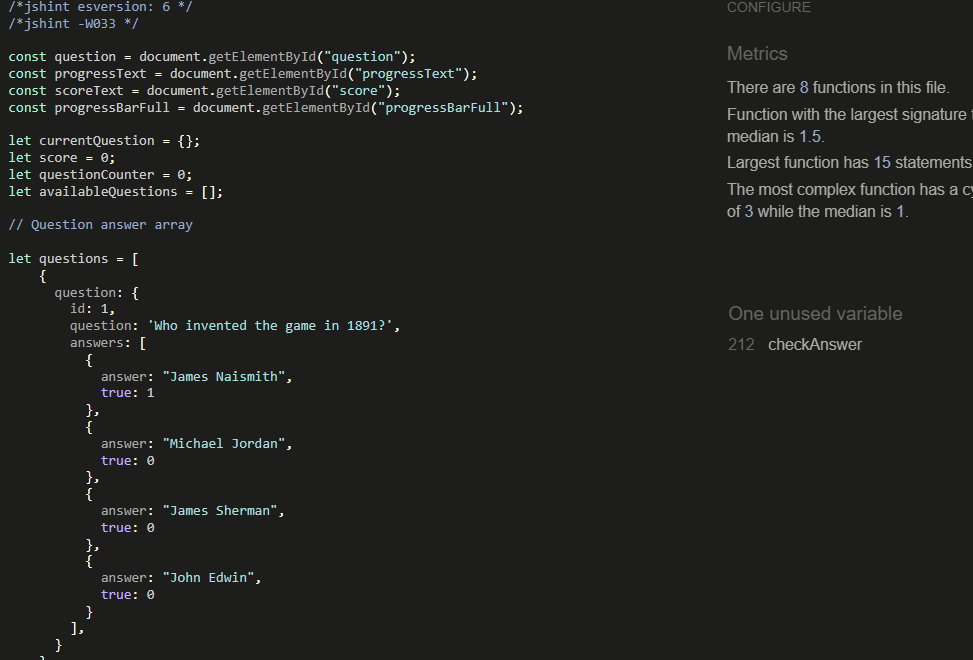
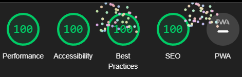

# Basketbal Game Quiz!!

Basketbal game quiz is a website for people who want to improve their knowledge about basketball and have fun with friends or family members. The primary gaol of this webpage is to enjoy, have fun and learn/check their knowledge about basketbal. The layout and content is simple to follow.

 to create and edit a project
* [Github](https://github.com/) storing and deploying your project
* [Google Fonts¨](https://fonts.google.com/) to find fonts and import into your project
* [W3C jigsaw validator](https://jigsaw.w3.org/css-validator/)check if the css code has any issues.
* [Validator w3](https://validator.w3.org/)check if the html code has any issues.
* [DevTools](https://developer.chrome.com/docs/devtools/) for editing existed project codes without doing any harm by writing a code on top, also to do a lighouse test for performace, SEO, best practice and accesability.
* [Jshint](https://jshint.com/)
* [Responsive web](https://ui.dev/amiresponsive)was used to validate the responsiveness and generate mockup imagery to be used.

# UX

##Website owners goal

* Create a fun quiz game to play.
* Users to enjoy playing quiz game.
* Create a fully responsive website on dekstop,mobile,tablet devices.
* Provide interesting facts about basketball.

## Users story

* Start the game easily.
* See questions and answer options.
* See how many questions there is.
* See progress bar.
* Be able to view in different devices such as dekstop, tablet,mobile devices.
* Navigate the pages, see if my answer is correct or incorrect, save results with username.
* Check final score.

## Reutrning User

*I want to find new questions and quizezes.

## Design

## Color scheme

the colours chosen for the project are :

* background color: rgb(20, 17, 18);
* font color : white;
* index button : rgb(104 21 8 / 0%) 0%, rgb(235 188 192) 100%);
* choices button : rgb(126, 112, 92, 0.7);
* username input  : black;

### Fonts

* font-family:'ZCOOL XiaoWei', serif was the main font.

## Features 

* This quiz has four pages. Pages are being switched by clicking the buttons.

* The page consists of background colour h1 basketbal quiz game title and two buttons (Play and Leaderboard).
* When clicked the Play button will send you to the game.
* Leaderboard button will send the user to results section.

 

* Second page has progressbar , scoreboard, randomized question and answer choices.
* Progressbar fills each time the user answers a question, to show the progress and question count changes accordingly.
* Scoreboard gives 20 points per correct answers if answered wrong, continues to next question without giving points.
* Choices are styled, everytime user hovers the choice it pops out to clarify which one was pointed.

* Shows your score on the top, with a welcoming message.
* User input is created so the user can write his name.
* Save button allows to save the username, when clicked sends back to the main page.
* Play again button when clicked will send you to the game page.
* Go Back button will send to the main page when clicked.

* When saving your score, you can navigate to leaderboard and it will open a page with Results.
* Each results will be classified from highest to lowest, numerical orderd.

Also when pressed on any choice a "Correct" or Incorrect" message will apppear to show your result.

## Future Features

* Will implement time counter.
* Choose dificulity questions level.
* Add backgroud music.
* Add some images.
* style better results section, maybe with an image or icons.

## Testing

* W3C Css validator no errors

* HTML checker no errors

* Jshint 

checkAnswer is being used as an attribute of an HTML element which passes two parameters, question ID and the answer itself
checkAnswer is not used on actual JS due to it being initialised with "onclick" event on HTML.

* Lightouse mobile results

* Lighthouse dekstop results

## Deployment

- Firstly, creating a gitpod account, the main browser is being used Chrome. Add the gitpod extension into chrome, log into gitpod with your registered account, check for project github respirotry which will let you creat a new repository, when clicked on gitpod green button.

* From GitHub navigate to the main page of the repository.
* Select the "code" button above the file list.
* Below the respitory, click Dowload
* In your local IDE open a terminal.
* Change the current working directory to the location where you want the cloned directory.
* Type git clone and paste the URL you just copied.
* Click enter and your local clone will be created.

# Credits

## Code

* Code institutes, slack, stackoverFlow and [w3school](http://https://www.w3schools.com/) helped me a lot during the whole coding process.
* Javascript build quiz tutorials [Youtube](https://www.youtube.com/playlist?list=PLDlWc9AfQBfZIkdVaOQXi1tizJeNJipEx) and [Youtube](https://www.youtube.com/watch?v=f4fB9Xg2JEY)

## Content

* Content was take only for educational purpose [Content](http://www.freepubquiz.co.uk/basketball-quiz.html)